# TaskManagerApplication

Note: This project began as a proof of concept for a technical interview at the Ballast Lane company.

Task Manager is a simple web application that allows authenticated users to create, read, update, and delete tasks organized into projects (lists). Every user has a default personal project, and can create additional projects. 

The backend is a RESTful API built with ASP.NET Core and the frontend uses Vue 3. The solution follows Clean Architecture principles and Test-Driven Development (TDD). Data access is implemented at a low level (without Entity Framework, Dapper, or Mediator). At the same time the application used SOLID principles to ensure maintainability and scalability.

The frontend is designed to be responsive, providing a good user experience on both mobile and desktop devices. The application allows users to manage their tasks and projects effectively, with a focus on simplicity and usability.

## User Stories
As a registered user, I want to organize my tasks into projects, so that I can separate personal tasks from project-specific work.
As a registered user, I want to create, read, update, and delete tasks, so that I can manage my work effectively.
As a registered user, I want to create, read, update, and delete projects, so that I can manage my workspaces.
As a registered user, I want to have a default personal project, so that I can start organizing my tasks immediately.
As a registered user, I want to be able to log in and log out, so that I can securely access my tasks and projects.
As a registered user, I want to have tasks that include an Id, ProjectId, Title, Description, CreatedAt timestamp, and IsCompleted status, so that I can track my tasks effectively and manage their completion status.

## Features
- User authentication and authorization
- Task management (CRUD operations)
- Project management (CRUD operations)
- Default personal project for each user
- Responsive design for mobile and desktop
- Clean Architecture implementation
- Test-Driven Development (TDD) approach
- RESTful API design
- Low-level data access without Entity Framework, Dapper, or Mediator
- Vue 3 frontend with modern JavaScript features

## Technologies Used
- ASP.NET Core for the backend
- Vue 3 for the frontend
- HTML5, CSS3, and JavaScript for the user interface
- RESTful API design principles
- Clean Architecture principles
- Test-Driven Development (TDD) practices

## Getting Started
1. Clone the repository to your local machine.
2. Open the solution in Visual Studio or your preferred IDE.
3. Restore the NuGet packages.
4. Build the solution to ensure all dependencies are resolved.
5. Run the backend API and the frontend application.
6. Open your web browser and navigate to the application URL (e.g., `http://localhost:5000`).
7. Register a new user or log in with existing credentials.
8. Start managing your tasks and projects!

## Contributing
If you find a bug or have a feature request, please open an issue on GitHub.

#Architecture
The solution follows Clean Architecture principles, which separate concerns into different layers. The main layers are:
- **Domain Layer**: Contains the core business logic and entities.
- **Application Layer**: Contains application-specific logic, such as use cases and services.
- **Infrastructure Layer**: Contains data access implementations and external service integrations.
- **Presentation Layer**: Contains the API controllers and the frontend application.

## ER Diagram
The ER diagram for the Task Manager application is as follows:


# Architecture Overview

This section provides an overview of the architecture of the Task Manager application, including the general architecture, frontend architecture, and backend architecture.

## General Architecture Overview

The neext diagram show the components in general and how these components interact with each other. The Task Manager application is structured into a frontend and a backend, with the frontend built using Vue 3 and the backend built using ASP.NET Core.


## Frontend Architecture Overview
The frontend of the Task Manager application is built using Vue 3, which provides a reactive and component-based architecture. The main components and their responsibilities are as follows:

- **App.vue**: The root component that initializes the application and sets up routing.
- **Auth.vue**: Handles user authentication (login and registration).
- **Projects.vue**: Displays the list of projects and allows project creation.
- **Tasks.vue**: Displays tasks for a selected project and allows task creation, updating, and deletion.
- **TaskItem.vue**: Represents an individual task item with completion tracking.
- **ProjectItem.vue**: Represents an individual project item with options to manage tasks.
- **Router**: Manages navigation between different views (e.g., authentication, projects, tasks).
- **Store**: Manages application state using Vuex, including user authentication state, projects, and tasks.


## Backend Architecture Overview

### Main Classes Summary

The Task Manager application is built using Clean Architecture principles, organized into four distinct layers. Here's a summary of the main classes and their responsibilities:

#### Domain Layer (Core Business Logic)
- **User**: Represents a user entity with authentication capabilities
- **Project**: Represents a project/workspace that contains tasks
- **TaskItem**: Represents individual tasks with completion tracking
- **Repository Interfaces**: Define contracts for data access (`IUserRepository`, `IProjectRepository`, `ITaskRepository`)
- **IUnitOfWork**: Manages transactions and coordinates repository operations

#### Application Layer (Use Cases & Business Rules)
- **Use Cases**: Encapsulate specific business operations (Create, Update, Delete, Get operations)
- **IAuthenticationService**: Handles user login and registration
- **DTOs**: Data transfer objects for API communication (`AuthResult`, `TaskDto`, `ProjectDto`)

#### Infrastructure Layer (Data Access & External Services)
- **Repository Implementations**: Concrete implementations of repository interfaces using raw SQL
- **UnitOfWork**: Manages database connections and transactions
- **AuthenticationService**: JWT token generation and validation

#### Presentation Layer (API Controllers)
- **Controllers**: Handle HTTP requests and responses (`AuthController`, `ProjectsController`, `TasksController`)

### Simplified Architecture Diagram

The following diagram shows the simplified view of the main components and how they interact:

```mermaid
graph TB
    subgraph "🎯 Presentation Layer"
        AC[AuthController]
        PC[ProjectsController] 
        TC[TasksController]
    end
    
    subgraph "📋 Application Layer"
        AS[AuthenticationService]
        CU[CreateUserUseCase]
        CP[CreateProjectUseCase]
        CT[CreateTaskUseCase]
        UT[UpdateTaskUseCase]
        GT[GetTasksUseCase]
        GP[GetProjectsUseCase]
    end
    
    subgraph "🔧 Infrastructure Layer"
        UOW[UnitOfWork]
        UR[UserRepository]
        PR[ProjectRepository]
        TR[TaskRepository]
    end
    
    subgraph "💎 Domain Layer"
        U[User]
        P[Project]
        T[TaskItem]
        IU[IUserRepository]
        IP[IProjectRepository]
        IT[ITaskRepository]
        IUOW[IUnitOfWork]
    end
    
    subgraph "🗄️ Database"
        DB[(SQL Database)]
    end

    %% Presentation to Application
    AC --> AS
    PC --> CP
    PC --> GP
    TC --> CT
    TC --> UT
    TC --> GT
    
    %% Application to Infrastructure
    AS --> UOW
    CU --> UOW
    CP --> UOW
    CT --> UOW
    UT --> UOW
    GT --> UOW
    GP --> UOW
    
    %% Infrastructure to Domain
    UOW --> UR
    UOW --> PR
    UOW --> TR
    UR -.-> IU
    PR -.-> IP
    TR -.-> IT
    UOW -.-> IUOW
    
    %% Domain relationships
    P --> U
    T --> P
    
    %% Infrastructure to Database
    UR --> DB
    PR --> DB
    TR --> DB
    
    %% Styling
    classDef presentation fill:#e8f5e8
    classDef application fill:#f3e5f5
    classDef infrastructure fill:#fff3e0
    classDef domain fill:#e1f5fe
    classDef database fill:#f0f0f0
    
    class AC,PC,TC presentation
    class AS,CU,CP,CT,UT,GT,GP application
    class UOW,UR,PR,TR infrastructure
    class U,P,T,IU,IP,IT,IUOW domain
    class DB database
```



### Key Design Patterns Used

1. **Clean Architecture**: Separation of concerns across layers with dependency inversion
2. **Unit of Work**: Manages transactions and coordinates multiple repository operations
3. **Repository Pattern**: Abstracts data access logic from business logic
4. **Dependency Injection**: Loose coupling between components
5. **Use Case Pattern**: Encapsulates business operations in focused classes
6. **Factory Methods**: Static methods on entities for object creation
7. **Interface Segregation**: Focused interfaces for specific responsibilities

### Data Flow Example

Here's how a typical request flows through the system:

1. **HTTP Request** → Controller receives API request
2. **Controller** → Calls appropriate Use Case
3. **Use Case** → Uses UnitOfWork to access repositories
4. **UnitOfWork** → Coordinates repository operations within a transaction
5. **Repository** → Executes SQL queries against the database
6. **Domain Entities** → Business logic and validation
7. **Response** → Data flows back through the layers to the client

This architecture ensures:
- **Testability**: Each layer can be tested independently
- **Maintainability**: Clear separation of concerns
- **Scalability**: Easy to add new features without affecting existing code
- **Flexibility**: Easy to change data access or presentation without affecting business logic

### Class Diagram

The next diagram shows the main classes and their relationships in the Task Manager application, which is based on Clean Architecture principles and SOLID principles:

```mermaid
classDiagram
    %% Domain Layer - Entities
    class User {
        +Guid Id
        +string Username
        +string PasswordHash
        +DateTime CreatedAt
        +static User Register(string username, string password)
        +bool ValidatePassword(string password)
    }

    class Project {
        +Guid Id
        +Guid UserId
        +string Name
        +DateTime CreatedAt
        +bool IsDefault
        +static Project Create(Guid userId, string name, bool isDefault)
        +void Rename(string newName)
    }

    class TaskItem {
        +Guid Id
        +Guid ProjectId
        +string Title
        +string Description
        +DateTime CreatedAt
        +bool IsCompleted
        +static TaskItem Create(Guid projectId, string title, string desc)
        +void Update(string title, string desc)
        +void MarkAsCompleted()
        +void MarkAsIncomplete()
    }

    %% Domain Layer - Repository Interfaces
    class IUserRepository {
        <<interface>>
        +Task<User> GetByIdAsync(Guid id)
        +Task<User> GetByUsernameAsync(string username)
        +Task AddAsync(User user)
        +Task UpdateAsync(User user)
        +Task<bool> ExistsAsync(string username)
    }

    class IProjectRepository {
        <<interface>>
        +Task<Project> GetByIdAsync(Guid id)
        +Task<IEnumerable<Project>> ListAsync(Guid userId)
        +Task<Project> GetDefaultProjectAsync(Guid userId)
        +Task AddAsync(Project project)
        +Task UpdateAsync(Project project)
        +Task DeleteAsync(Guid id)
    }

    class ITaskRepository {
        <<interface>>
        +Task<TaskItem> GetByIdAsync(Guid id)
        +Task<IEnumerable<TaskItem>> ListAsync(Guid projectId)
        +Task<IEnumerable<TaskItem>> ListByUserAsync(Guid userId)
        +Task AddAsync(TaskItem task)
        +Task UpdateAsync(TaskItem task)
        +Task DeleteAsync(Guid id)
    }

    %% Unit of Work Pattern
    class IUnitOfWork {
        <<interface>>
        +IUserRepository Users
        +IProjectRepository Projects
        +ITaskRepository Tasks
        +Task<int> SaveChangesAsync()
        +Task BeginTransactionAsync()
        +Task CommitTransactionAsync()
        +Task RollbackTransactionAsync()
        +void Dispose()
    }

    %% Application Layer - Use Cases
    class IAuthenticationService {
        <<interface>>
        +Task<AuthResult> LoginAsync(string username, string password)
        +Task<AuthResult> RegisterAsync(string username, string password)
        +string GenerateToken(User user)
    }

    class CreateUserUseCase {
        -IUnitOfWork unitOfWork
        +Task<Guid> ExecuteAsync(string username, string password)
    }

    class CreateProjectUseCase {
        -IUnitOfWork unitOfWork
        +Task<Guid> ExecuteAsync(Guid userId, string name, bool isDefault)
    }

    class CreateTaskUseCase {
        -IUnitOfWork unitOfWork
        +Task<Guid> ExecuteAsync(Guid projectId, string title, string desc)
    }

    class UpdateTaskUseCase {
        -IUnitOfWork unitOfWork
        +Task ExecuteAsync(Guid taskId, string title, string description)
    }

    class CompleteTaskUseCase {
        -IUnitOfWork unitOfWork
        +Task ExecuteAsync(Guid taskId)
    }

    class DeleteTaskUseCase {
        -IUnitOfWork unitOfWork
        +Task ExecuteAsync(Guid taskId)
    }

    class GetProjectTasksUseCase {
        -IUnitOfWork unitOfWork
        +Task<IEnumerable<TaskItem>> ExecuteAsync(Guid projectId)
    }

    class GetUserProjectsUseCase {
        -IUnitOfWork unitOfWork
        +Task<IEnumerable<Project>> ExecuteAsync(Guid userId)
    }

    %% Application Layer - DTOs
    class AuthResult {
        +bool Success
        +string Token
        +string ErrorMessage
        +User User
    }

    class TaskDto {
        +Guid Id
        +string Title
        +string Description
        +DateTime CreatedAt
        +bool IsCompleted
    }

    class ProjectDto {
        +Guid Id
        +string Name
        +DateTime CreatedAt
        +bool IsDefault
        +int TaskCount
    }

    %% Infrastructure Layer - Implementations
    class UnitOfWork {
        -IDbConnection connection
        -IDbTransaction transaction
        -IUserRepository users
        -IProjectRepository projects
        -ITaskRepository tasks
        +IUserRepository Users
        +IProjectRepository Projects
        +ITaskRepository Tasks
        +Task<int> SaveChangesAsync()
        +Task BeginTransactionAsync()
        +Task CommitTransactionAsync()
        +Task RollbackTransactionAsync()
        +void Dispose()
    }

    class UserRepository {
        -IDbConnection connection
        +Task<User> GetByIdAsync(Guid id)
        +Task<User> GetByUsernameAsync(string username)
        +Task AddAsync(User user)
        +Task UpdateAsync(User user)
        +Task<bool> ExistsAsync(string username)
    }

    class ProjectRepository {
        -IDbConnection connection
        +Task<Project> GetByIdAsync(Guid id)
        +Task<IEnumerable<Project>> ListAsync(Guid userId)
        +Task<Project> GetDefaultProjectAsync(Guid userId)
        +Task AddAsync(Project project)
        +Task UpdateAsync(Project project)
        +Task DeleteAsync(Guid id)
    }

    class TaskRepository {
        -IDbConnection connection
        +Task<TaskItem> GetByIdAsync(Guid id)
        +Task<IEnumerable<TaskItem>> ListAsync(Guid projectId)
        +Task<IEnumerable<TaskItem>> ListByUserAsync(Guid userId)
        +Task AddAsync(TaskItem task)
        +Task UpdateAsync(TaskItem task)
        +Task DeleteAsync(Guid id)
    }

    class AuthenticationService {
        -IUnitOfWork unitOfWork
        -IJwtTokenGenerator tokenGenerator
        +Task<AuthResult> LoginAsync(string username, string password)
        +Task<AuthResult> RegisterAsync(string username, string password)
        +string GenerateToken(User user)
    }

    %% Presentation Layer - Controllers
    class AuthController {
        -IAuthenticationService authService
        +Task<IActionResult> Login(LoginRequest request)
        +Task<IActionResult> Register(RegisterRequest request)
    }

    class ProjectsController {
        -CreateProjectUseCase createProjectUseCase
        -GetUserProjectsUseCase getUserProjectsUseCase
        +Task<IActionResult> GetProjects()
        +Task<IActionResult> CreateProject(CreateProjectRequest request)
    }

    class TasksController {
        -CreateTaskUseCase createTaskUseCase
        -UpdateTaskUseCase updateTaskUseCase
        -CompleteTaskUseCase completeTaskUseCase
        -DeleteTaskUseCase deleteTaskUseCase
        -GetProjectTasksUseCase getProjectTasksUseCase
        +Task<IActionResult> GetTasks(Guid projectId)
        +Task<IActionResult> CreateTask(CreateTaskRequest request)
        +Task<IActionResult> UpdateTask(Guid id, UpdateTaskRequest request)
        +Task<IActionResult> CompleteTask(Guid id)
        +Task<IActionResult> DeleteTask(Guid id)
    }

    %% Relationships - Domain
    Project --> User : belongs to
    TaskItem --> Project : belongs to

    %% Relationships - Use Cases to Repositories
    CreateUserUseCase --> IUnitOfWork : uses
    CreateProjectUseCase --> IUnitOfWork : uses
    CreateTaskUseCase --> IUnitOfWork : uses
    UpdateTaskUseCase --> IUnitOfWork : uses
    CompleteTaskUseCase --> IUnitOfWork : uses
    DeleteTaskUseCase --> IUnitOfWork : uses
    GetProjectTasksUseCase --> IUnitOfWork : uses
    GetUserProjectsUseCase --> IUnitOfWork : uses

    %% Relationships - Authentication
    AuthenticationService --> IUnitOfWork : uses
    AuthenticationService --> AuthResult : creates

    %% Relationships - Unit of Work
    UnitOfWork ..|> IUnitOfWork : implements
    UnitOfWork --> IUserRepository : contains
    UnitOfWork --> IProjectRepository : contains
    UnitOfWork --> ITaskRepository : contains

    %% Relationships - Repository Implementations
    UserRepository ..|> IUserRepository : implements
    ProjectRepository ..|> IProjectRepository : implements
    TaskRepository ..|> ITaskRepository : implements
    AuthenticationService ..|> IAuthenticationService : implements

    %% Relationships - Controllers to Use Cases
    AuthController --> IAuthenticationService : uses
    ProjectsController --> CreateProjectUseCase : uses
    ProjectsController --> GetUserProjectsUseCase : uses
    TasksController --> CreateTaskUseCase : uses
    TasksController --> UpdateTaskUseCase : uses
    TasksController --> CompleteTaskUseCase : uses
    TasksController --> DeleteTaskUseCase : uses
    TasksController --> GetProjectTasksUseCase : uses

    %% Clean Architecture Layer Grouping
    classDef domainLayer fill:#e1f5fe
    classDef applicationLayer fill:#f3e5f5
    classDef infrastructureLayer fill:#fff3e0
    classDef presentationLayer fill:#e8f5e8

    class User,Project,TaskItem domainLayer
    class IUserRepository,IProjectRepository,ITaskRepository,IUnitOfWork domainLayer
    class CreateUserUseCase,CreateProjectUseCase,CreateTaskUseCase applicationLayer
    class UpdateTaskUseCase,CompleteTaskUseCase,DeleteTaskUseCase applicationLayer
    class GetProjectTasksUseCase,GetUserProjectsUseCase applicationLayer
    class IAuthenticationService,AuthResult,TaskDto,ProjectDto applicationLayer
    class UnitOfWork,UserRepository,ProjectRepository,TaskRepository infrastructureLayer
    class AuthenticationService infrastructureLayer
    class AuthController,ProjectsController,TasksController presentationLayer
```

# Structure Folders Project
The project is organised into several folders to maintain clarity and structure. Here’s a brief overview of the folder structure:
- The frontend folder contains the code for the frontend application.
- The backend folder contains the code for the backend application.

## Folder Structure Diagram

```bash
TaskManagerApplication/
├── backend/
│   ├──src/
│   │   ├── Controllers/
│   │   ├── Domain/
│   │   ├── Application/
│   │   ├── Infrastructure/
│   │   ├── Data/
│   │   ├── Services/
│   │   ├── Models/
│   │   ├── Repositories/
│   │   ├── UseCases/
│   │   ├── DTOs/
│   │   ├── Program.cs
│   │   ├── Startup.cs
│   │   └── TaskManagerApplication.csproj
│   ├── tests/
│   │   ├── TaskManagerApplication.Tests/
│   │   ├── TaskManagerApplication.IntegrationTests/
│   │   └── TaskManagerApplication.UnitTests/
│   ├── TaskManagerApplication.sln
│   ├── TaskManagerApplication.csproj
│   ├── appsettings.json
│   ├── appsettings.Development.json
│   ├── Dockerfile
│   ├── docker-compose.yml
│   └── README.md
├── frontend/
│   ├── src/
│   │   ├── components/
│   │   ├── views/
│   │   ├── services/
│   │   ├── store/
│   │   ├── router/
│   │   ├── App.vue
│   │   ├── main.js
│   │   └── assets/
│   ├── public/
│   ├── package.json
│   ├── vue.config.js
│   └── vite.config.js
└── README.md
```
